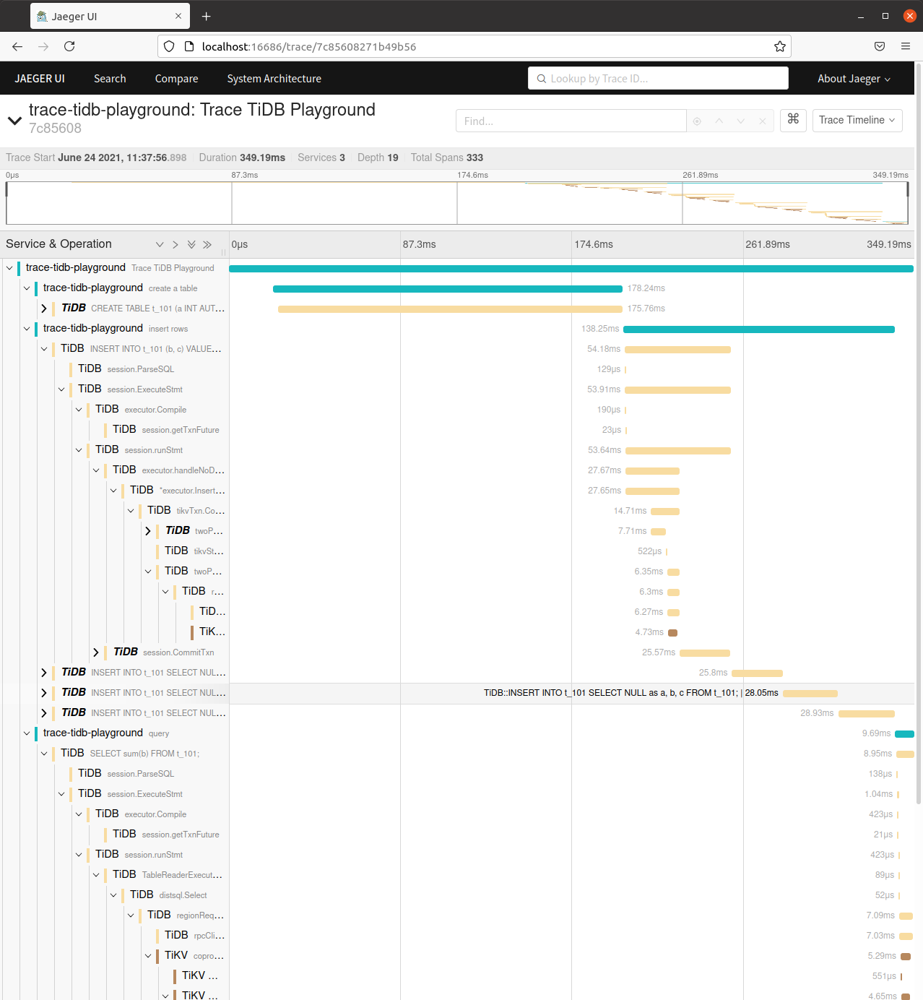

# trace-tidb-playground

## Get Started

### Build and Start TiDB Cluster Locally

Follow https://github.com/pingcap/tidb/pull/19557#issue-475051888

```shell
mkdir trace-tidb && cd trace-tidb

# Build TiDB
git clone -b tracing https://github.com/zhongzc/tidb --depth=1
(cd tidb && make)

# Build TiKV
git clone -b new-minitrace https://github.com/zhongzc/tikv --depth=1
(cd tikv && make build)

# Create TiDB Config File
echo -e '[log]\nslow-threshold=5\n[trace]\nenable = true\njaeger-thrift-compact-agent = "127.0.0.1:6831"\n"' > tidb.config

# Start Cluster
tiup playground v4.0.12 --db.binpath=tidb/bin/tidb-server --db.config=tidb.config --kv.binpath=tikv/target/debug/tikv-server --tiflash 0
```

### Run Jaeger

```shell
docker run --rm -d -p6831:6831/udp -p16686:16686 --name jaeger jaegertracing/all-in-one:latest
```

## Run App

```shell
go run main.go
```

## Expect

Open http://localhost:16686 and we can navigate to


